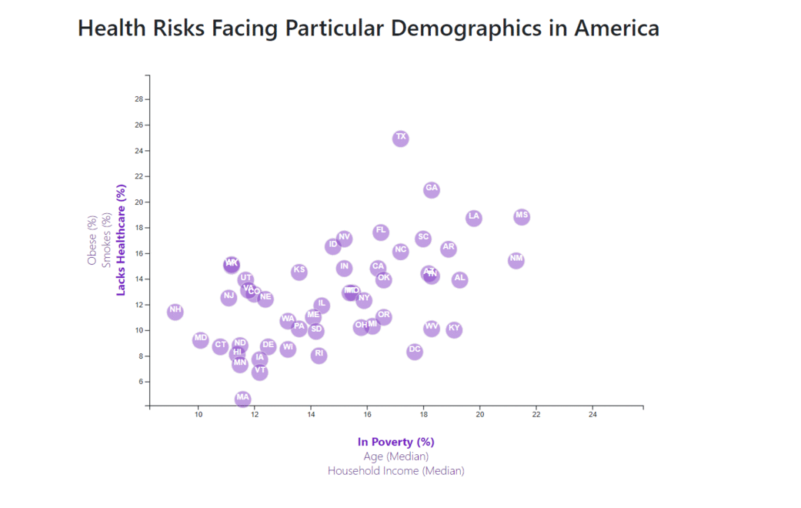
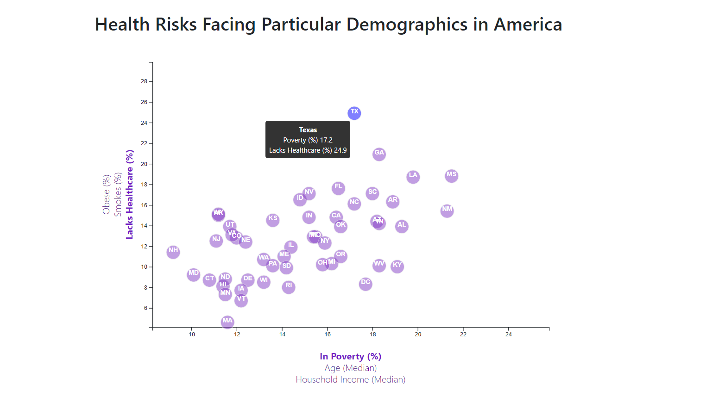

# Data Journalism and D3

#### Why make a static graphic when D3 lets you interact with your data?

In this project I analyzed the current trends shaping people's lives, as well as creating charts, graphs, and interactive elements to help readers understand my findings.

This Data Driven Document(D3) project demonstrates building an interactive data visualization showing state-level data about three health risk factors (obesity, smoking and lack of healthcare) plotted against three perhaps underlying factors (income, poverty rate and age) based on 2014 U.S. Census data. The Chart was build using D3.js. Each marker represents an individual state in The USA.

The data set used in this analysis is based on 2014 ACS 1-year estimates from the [US Census Bureau](https://data.census.gov/cedsci/). I utilized information from the [US Census Bureau](https://data.census.gov/cedsci/) and the Behavioral Risk Factor Surveillance System, create charts, graphs and interactive visualizations to help understand findings

The charts above display positive correlations between risk factors obesity and smoking in relation to poverty and household income. The visible trend indicates that less affluent and poorer states have higher obesity rates and greater tendencies of smoking. Wealthier states not only had higher rates of healthcare coverage, but lower obesity and smoking rates. The visualizations also indicate that the trends are not absolute because there are some clear outliers. For example, there are states such as North Dakota and Iowa with relatively low poverty and high obesity rates.

The correlations between health risks and age are more convoluted. The median ages in most US states are between 36-40 years old. This clustered the visualizations making them more difficult to identify. However, a keen eye would be able to see that there are indeed some correlations, such as: higher median age and higher healthcare coverage, lower median age and lower smoking rates, and finally, lower median age and lower obesity rates.

##### 														Fereshteh Aghaei © 2021. All Rights Reserved.